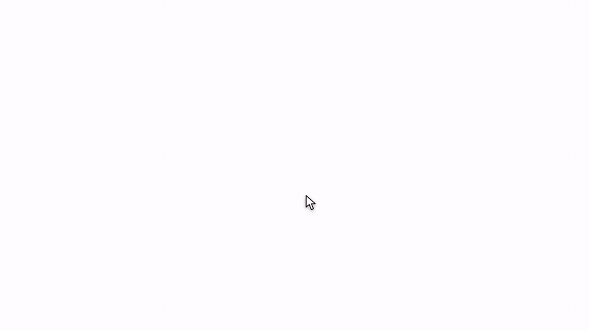
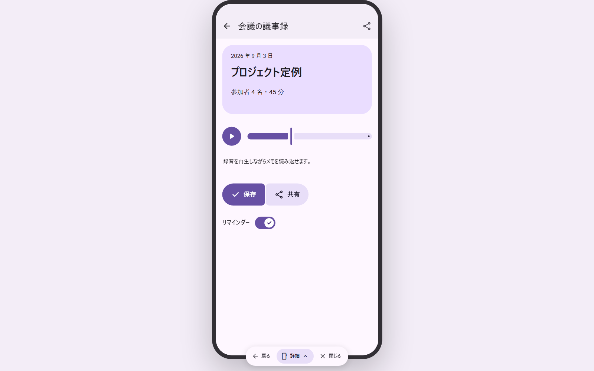
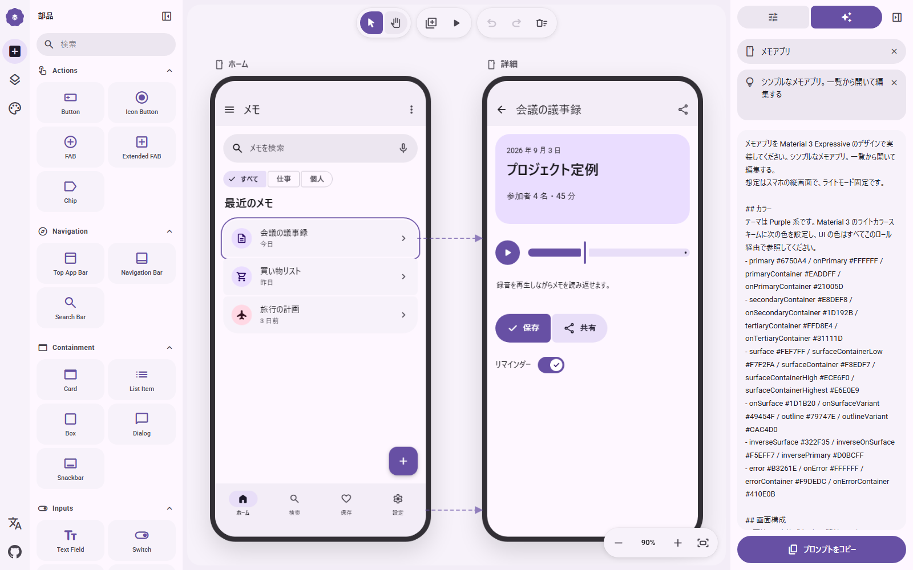
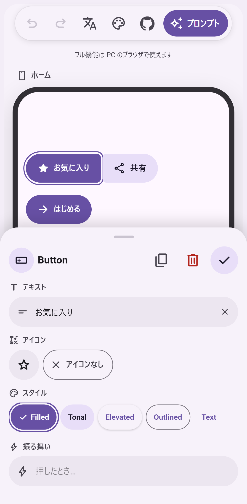

<p align="center">
  
</p>

<h1 align="center">M3E Canvas</h1>

<p align="center">
  <strong>Sketch Material 3 Expressive screens in the browser, link them, tap through them, and copy a prompt for your AI coding tool.</strong>
</p>

<p align="center">
  <a href="https://lnkiai.github.io/m3e-canvas/"></a>
  <a href="https://github.com/lnkiai/m3e-canvas/actions/workflows/deploy.yml"></a>
  <a href="https://github.com/lnkiai/m3e-canvas/stargazers"></a>
  <a href="LICENSE"></a>
  <a href="https://github.com/sponsors/lnkiai"></a>
  
  
  
  
</p>

<p align="center">
  <a href="https://trendshift.io/repositories/208608"></a>
</p>

<p align="center">
  <a href="#日本語">日本語</a> · <a href="#中文">中文</a> · <a href="#한국어">한국어</a> · <a href="https://lnkiai.github.io/m3e-canvas/">Open the app</a>
</p>



<p align="center"><sub>Sketch a recipes app, retheme it, copy the prompt, hand it to an AI coding tool, and run the result on Android. (<a href="docs/story.mp4">mp4</a>)</sub></p>

Works with any AI coding tool that takes a prompt, such as Claude Code, Codex, Gemini CLI or Cursor: copy the prompt, paste it into the tool, and ask for the app.

## What it does

- **Drag-and-drop parts** – buttons, icon buttons, FABs, split buttons, FAB menus, chips, app bars, navigation bars, floating toolbars, tabs, search bars, cards, lists, dialogs, snackbars, text fields, dropdowns, switches, checkboxes, radio buttons, sliders, text, images, camera and map placeholders, badges, boxes and dividers, all drawn to Material 3 Expressive.
- **Magnetic connections** – bring two buttons or list items close and they fuse into a connected group; the corners soften as they meet.
- **Real M3 Expressive loading** – the shape-morphing Loading Indicator (ported from material-components-android) and wavy linear / circular progress indicators.
- **Phone and desktop screens** – add as many screens as you like, name them, pick a background, and drag a screen to move everything on it. Switch any screen between a 412×892 phone and a 1280×800 desktop from its label: bars stretch, the navigation bar becomes a rail (and a rail becomes a bar again on a phone), and the parts are laid out again beside it. Screens of both sizes can share one design; same-named screens are written into the prompt as one screen at two widths.
- **Tap to navigate** – give any tappable part, an app bar icon or a navigation bar destination a target screen (or "back") and a transition: slide from any of the four sides, fade, expand or none. Arrows show the flow on the canvas; the preview lets you tap through it, and back plays the transition in reverse.
- **Swipe to navigate** – a screen can open another on a left / right / up / down swipe. In the preview the screen follows your finger, and the reverse swipe goes back.
- **Toggle buttons** – any button can flip on tap, changing its icon and style.
- **Layers and groups** – a layers panel lists the z-order of each screen; drag a row to bring parts forward or send them back, and open a group or a connected run to reorder what is inside it. Select several parts and group them to keep their overlap and move them as one. The prompt describes overlaps and side-by-side rows explicitly so the generated layout keeps them.
- **Theme** – the four M3 Expressive axes in one panel. Color: seven presets or one seed color that becomes a full Material 3 scheme you can fine-tune, light / dark, three contrast levels and a dynamic-color switch (match the phone wallpaper). Shape: square, rounded or full corners for every part at once. Type: Roboto, Roboto Flex, Roboto Serif or the system font, with the emphasized styles. Motion: the standard or the expressive spring scheme, which also drives the preview.
- **Prompt output** – the whole design (or a single screen) becomes a concise natural-language prompt in Japanese, English, Chinese or Korean, including your own notes on what each part does. Pick Android (the default) or the web as the target and the prompt asks for the matching stack.
- **Tidy** – one button snaps bars to the edges, the FAB to the corner, joins neighbouring list items and buttons, and stacks the rest on 16dp margins. Press it again to undo.
- **Optional AI helper** – bring your own key (OpenAI, Claude, Gemini or DeepSeek) and let the model write a part's behavior note or a screen's description, in your language. Each rewrite can be undone. The key stays in your browser and the request goes straight to the provider; there is no server in between.
- **Export** – copy the prompt (edit it by hand first if you like) or save a screen as a PNG.
- **Share links and AI drafts (beta)** – copy a link that opens your design on anyone's canvas, or copy an instruction for Claude Code, Codex or another coding agent: it reads [agent.md](public/agent.md), sketches what you described, and replies with such a link.
- **Alignment guides**, undo/redo, keyboard shortcuts, seven color themes, a favorites row in the parts panel, and everything is saved in your browser (localStorage).
- **Phone-friendly** – on a phone you get one fixed screen and a buttons-only editor: tap the plus to add a button, tap a button to move it, and edit its text, icon and style in a bottom sheet. The full multi-screen editor is for desktop browsers.

<table>
  <tr>
    <td width="50%"><br /><sub>Preview: tap a part and the linked screen slides in.</sub></td>
    <td width="50%"><br /><sub>Prompt: the design as a concise brief in the selected language.</sub></td>
  </tr>
</table>

<p align="center"><br /><sub>Phone: one screen, buttons only, edited in a bottom sheet.</sub></p>

## Keyboard

| Key | Action |
| --- | --- |
| `V` / `H` | Select / hand tool (hold `Space` to pan) |
| Wheel, `Ctrl` + wheel | Pan, zoom |
| `+` `-` `0` | Zoom in, zoom out, fit |
| `Ctrl+Z` / `Ctrl+Shift+Z` | Undo / redo |
| `Ctrl+D` | Duplicate |
| Arrows (`Shift` = 8dp) | Nudge |
| `Ctrl` + drag | Move without snapping (no guides, no 4dp grid) |
| `Delete` | Delete part or screen |
| `P` | Preview |

## Develop

```bash
npm install
npm run dev        # http://localhost:3000
npm run build      # static export to ./out
```

The app is a static Next.js export. To host it under a sub-path (for example a GitHub Pages project site), set `NEXT_PUBLIC_BASE_PATH=/your-repo` at build time. `.github/workflows/deploy.yml` does this automatically and publishes `out/` to GitHub Pages on every push to `main`.

## Contributing

Bug reports, part requests and pull requests are welcome. [CONTRIBUTING.md](CONTRIBUTING.md) explains the setup, the conventions (English comments, four languages for every string) and where each kind of change lives. Questions go to [Discussions](https://github.com/lnkiai/m3e-canvas/discussions).

## Support

M3E Canvas is free and MIT-licensed, and stays that way. If it saves you time, you can [sponsor the work on GitHub](https://github.com/sponsors/lnkiai); it pays for the hours that go into new parts, the prompt, and reviewing contributions. No feature is behind sponsorship.

Thanks to the sponsors who keep this going:

- [Yspritan](https://github.com/YspritanHyzygy)

## Credits

- Loading indicator shapes and animation model: [material-components-android](https://github.com/material-components/material-components-android) (Apache-2.0) via [Aler1x/m3-loading-indicator](https://github.com/Aler1x/m3-loading-indicator). See `NOTICE`.
- Icons: [Material Symbols](https://fonts.google.com/icons) (Apache-2.0). Fonts are loaded from Google Fonts.

## See also

- [matraic/m3e](https://github.com/matraic/m3e) – Material 3 Expressive as Lit web components (MIT), with React bindings and an icon package. A good home for the screens you sketch here.
- [Beer CSS](https://www.beercss.com/) – Material Design 3 as a plain CSS framework (MIT). Another way to build the web version of a screen you sketch here.

## License

MIT © lnkiai

---

## 日本語

**Material 3 Expressive の画面をブラウザで組み立てて、画面同士をつなぎ、タップして確かめ、そのまま AI コーディング用のプロンプトにするツールです。**

公開版: https://lnkiai.github.io/m3e-canvas/


<p align="center"><sub>レシピアプリを組み、テーマを変え、プロンプトをコピーして AI コーディングツールに渡し、できたアプリを Android で動かすまで。（<a href="docs/story.mp4">mp4</a>）</sub></p>

Claude Code、Codex、Gemini CLI、Cursor など、プロンプトを受け取れる AI コーディングツールならどれでも使えます。プロンプトをコピーしてツールに貼り、アプリを作ってと頼むだけです。

### できること

- **ドラッグ＆ドロップ** – ボタン、アイコンボタン、FAB、スプリットボタン、FAB メニュー、チップ、アプリバー、ナビゲーションバー、フローティングツールバー、タブ、検索バー、カード、リスト、ダイアログ、スナックバー、テキスト入力、ドロップダウン、スイッチ、チェックボックス、ラジオボタン、スライダー、テキスト、画像、カメラと地図のプレースホルダー、バッジ、ボックス、区切り線。
- **磁石のような連結** – ボタンやリスト項目を近づけると 1 つのグループにくっつき、角が溶けてつながります。
- **本物の M3 Expressive ローディング** – 形が変化する Loading Indicator（Android 実装からの移植）と、波形のリニア／サーキュラープログレス。
- **スマホ画面とデスクトップ画面** – 画面を何枚でも追加して名前や背景色を付け、画面ごと動かせます。画面のラベルから 412×892 のスマホと 1280×800 のデスクトップを切り替えられ、バーは伸び、ナビゲーションバーはレールに（スマホに戻せばレールはバーに）なり、部品はその横に並べ直されます。両方のサイズを 1 つのデザインに混在でき、同じ名前の画面はプロンプトで「1 つの画面の 2 つの幅」として書かれます。
- **タップで遷移** – 部品、アプリバーのアイコン、ナビゲーションバーの項目に移動先の画面（または「戻る」）と遷移を設定。スライドは上下左右の 4 方向、ほかにフェード／拡大／なし。キャンバスに矢印が出て、プレビューでは実際にタップして確かめられ、戻るときは遷移が逆再生されます。
- **スワイプで遷移** – 画面に左右上下のスワイプ先を設定できます。プレビューでは指の動きに画面が追従し、逆方向のスワイプで戻れます。
- **切り替えボタン** – ボタンをタップでオン／オフが切り替わるトグルにして、オン時のアイコンとスタイルを指定できます。
- **レイヤーとグループ** – 画面ごとの重なり順をレイヤーパネルで確認し、ドラッグで前後を入れ替えられます。グループや連結した列は開いて、中の順番も入れ替えられます。複数選択してグループ化すると、重なりを保ったまま一緒に動かせます。プロンプトには重なりや横並びが明示され、生成されるレイアウトが崩れにくくなります。
- **テーマ** – M3 Expressive の 4 つの軸を 1 つのパネルで。カラーは 7 種のプリセットか、ベース色 1 つから Material 3 のスキーム全体を生成して微調整でき、ライト／ダーク、3 段階のコントラスト、壁紙に合わせるダイナミックカラーも指定できます。シェイプは全部品の角丸をスクエア／標準／フルでまとめて切り替え。タイポグラフィは Roboto、Roboto Flex、Roboto Serif、システムフォントと強調スタイル。モーションはスタンダード／エクスプレッシブで、プレビューの遷移にも反映されます。
- **プロンプト出力** – デザイン全体、または 1 画面だけを、日本語・英語・中国語・韓国語の簡潔な文章にします。部品ごとの「振る舞い」メモもそのまま入ります。実装先は Android（既定）と Web から選べ、プロンプトはそれに合った技術で書かれます。
- **整える** – ボタンひとつでバーを端に、FAB を隅に寄せ、隣り合うリスト項目やボタンをつなげ、残りを余白 16dp で積み直します。もう一度押すと元に戻ります。
- **AI 補助（任意）** – 自分のキー（OpenAI、Claude、Gemini、DeepSeek）を入れると、部品の動作や画面の説明を UI の言語で書いてもらえます。書き換えは元に戻せます。キーはブラウザ内にだけ保存され、リクエストはプロバイダへ直接送られます（間にサーバーはありません）。
- **書き出し** – プロンプトのコピー（手で編集してからも可）、画面の PNG 保存。
- **共有リンクと AI の下書き（ベータ）** – 設計を相手のキャンバスで開けるリンクをコピーできます。Claude Code や Codex などのコーディングエージェント向けの指示もコピーでき、エージェントが [agent.md](public/agent.md) を読んでスケッチを作り、そのリンクで返してきます。
- **補助線スナップ**、Undo/Redo、キーボードショートカット、7 種のカラーテーマ、お気に入り部品。作業内容はブラウザ（localStorage）に自動保存されます。
- **スマホでも** – スマホでは 1 画面固定のボタン専用エディタになります。プラスでボタンを追加し、タップして動かし、ボトムシートでテキスト・アイコン・スタイルを編集できます。複数画面のフル機能は PC のブラウザ向けです。

### 開発

```bash
npm install
npm run dev        # http://localhost:3000
npm run build      # ./out に静的書き出し
```

静的サイトとして書き出す構成です。サブパス（GitHub Pages のプロジェクトサイトなど）で配信するときはビルド時に `NEXT_PUBLIC_BASE_PATH=/リポジトリ名` を指定してください。`.github/workflows/deploy.yml` が `main` への push ごとにこれを行い、GitHub Pages に公開します。

### 貢献

バグ報告、部品のリクエスト、PR を歓迎します。手順と約束事は [CONTRIBUTING.md](CONTRIBUTING.md) にまとめています。質問は [Discussions](https://github.com/lnkiai/m3e-canvas/discussions) へどうぞ。

### 支援

M3E Canvas は無料で MIT ライセンスのまま続けます。時間の節約になったら、[GitHub Sponsors](https://github.com/sponsors/lnkiai) で開発を支えてもらえると助かります。新しい部品、プロンプトの調整、貢献のレビューにかかる時間に充てます。支援の有無で使える機能は変わりません。

開発を支えてくださっているスポンサーの方々に感謝します。

- [Yspritan](https://github.com/YspritanHyzygy)

### ライセンス

MIT © lnkiai

---

## 中文

**在浏览器中拼装 Material 3 Expressive 界面，把屏幕连起来、点一点试试，然后直接变成给 AI 编程工具的提示词。**

在线版本：https://lnkiai.github.io/m3e-canvas/


<p align="center"><sub>拼装一个食谱应用、更换主题、复制提示词、交给 AI 编程工具，然后在 Android 上运行成品。（<a href="docs/story.mp4">mp4</a>）</sub></p>

可配合任何接受提示词的 AI 编程工具使用，例如 Claude Code、Codex、Gemini CLI 或 Cursor：复制提示词，粘贴到工具里，让它把应用做出来。

### 功能

- **拖放组件** – 按钮、图标按钮、FAB、拆分按钮、FAB 菜单、标签片、应用栏、导航栏、悬浮工具栏、标签页、搜索栏、卡片、列表、对话框、消息条、文本输入框、下拉菜单、开关、复选框、单选按钮、滑块、文本、图片、相机和地图占位符、徽标、容器框和分割线，全部按 Material 3 Expressive 绘制。
- **磁吸连接** – 把两个按钮或列表项靠近，它们会合并成一个相连的组，圆角随之融合。
- **真正的 M3 Expressive 加载动画** – 形状变化的 Loading Indicator（移植自 material-components-android）以及波浪形的线性／圆形进度条。
- **手机与桌面屏幕** – 想加多少个屏幕都可以，为它们命名、选择背景，拖动屏幕即可整体移动。在屏幕标签上可在 412×892 的手机和 1280×800 的桌面之间切换：栏会拉伸，导航栏变为侧边导航栏（切回手机时侧边导航栏又变回导航栏），组件在其旁边重新排列。两种尺寸可以共存于一个设计中，同名屏幕会在提示词中写成“同一个屏幕的两种宽度”。
- **点击跳转** – 给任意可点击的组件、应用栏图标或导航栏项目设置目标屏幕（或“返回”）和过渡：从四个方向滑入、淡入、放大或无动画。画布上会显示流程箭头，预览中可以真的点击跳转，返回时反向播放过渡。
- **滑动跳转** – 屏幕可以设置左右上下滑动的目标。预览中屏幕会跟随手指移动。
- **切换按钮** – 任何按钮都可以做成点击切换的按钮，开启时改变文字、图标和样式。
- **图层与编组** – 图层面板显示每个屏幕的层叠顺序，可拖动调整前后，展开编组或相连的组件还能调整其内部顺序；多选后可编组，保持叠放关系并一起移动。提示词会明确写出叠放和横向排列，让生成的布局不走样。
- **主题** – 在一个面板里调整 M3 Expressive 的四个维度。配色：七套预设，或用一个基准色生成整套 Material 3 配色并微调，支持浅色／深色、三档对比度和动态配色（跟随手机壁纸）。形状：一次切换所有组件的圆角（方形／圆角／全圆）。字体：Roboto、Roboto Flex、Roboto Serif 或系统字体，并可开启强调样式。动效：标准或富有表现力的弹簧方案，同时作用于预览过渡。
- **提示词输出** – 整个设计（或单个屏幕）会变成简洁的自然语言提示词，支持日文、英文、中文和韩文，并包含你为每个组件写的行为说明。目标平台可选 Android（默认）或 Web，提示词会相应地要求对应的技术栈。
- **整理** – 一键把栏贴到边缘、FAB 放到角落、相邻的列表项和按钮连成一组，其余组件按 16dp 边距重新堆叠。再按一次即可撤销。
- **AI 辅助（可选）** – 填入自己的密钥（OpenAI、Claude、Gemini 或 DeepSeek），让模型用界面语言写出组件的行为或屏幕的说明。每次改写都可以撤销。密钥只保存在浏览器中，请求直接发送给服务商，中间没有服务器。
- **导出** – 复制提示词（也可先手动编辑），或把屏幕保存为 PNG。
- **分享链接与 AI 草图（测试版）** – 复制一个能在他人画布上打开你设计的链接；也可以复制给 Claude Code、Codex 等编程代理的指令，代理会阅读 [agent.md](public/agent.md)、画出你描述的草图，并以这样的链接回复。
- **对齐辅助线**、撤销／重做、键盘快捷键、收藏组件，所有内容自动保存在浏览器（localStorage）中。
- **手机也能用** – 在手机上是一个固定屏幕、只有按钮的简易编辑器：点加号添加按钮，点按钮移动，在底部面板里编辑文字、图标和样式。多屏幕的完整功能请在电脑浏览器中使用。

### 开发

```bash
npm install
npm run dev        # http://localhost:3000
npm run build      # 静态导出到 ./out
```

项目以静态站点方式导出。若要部署在子路径下（例如 GitHub Pages 的项目站点），请在构建时设置 `NEXT_PUBLIC_BASE_PATH=/仓库名`。`.github/workflows/deploy.yml` 会在每次推送到 `main` 时自动完成这一步并发布到 GitHub Pages。

### 参与贡献

欢迎 Bug 报告、组件请求和 PR。步骤和约定见 [CONTRIBUTING.md](CONTRIBUTING.md)。提问请到 [Discussions](https://github.com/lnkiai/m3e-canvas/discussions)。

### 支持

M3E Canvas 免费且采用 MIT 许可证，今后也不会改变。如果它为你节省了时间，欢迎在 [GitHub Sponsors](https://github.com/sponsors/lnkiai) 上支持开发；这些支持将用于新组件、提示词的打磨和审阅贡献所花的时间。没有任何功能因赞助而受限。

感谢支持本项目的赞助者：

- [Yspritan](https://github.com/YspritanHyzygy)

### 许可证

MIT © lnkiai

---

## 한국어

**Material 3 Expressive 화면을 브라우저에서 스케치하고, 화면끼리 연결하고, 탭해 보며, 그대로 AI 코딩 도구용 프롬프트로 만드는 도구입니다.**

공개 버전: https://lnkiai.github.io/m3e-canvas/


<p align="center"><sub>레시피 앱을 만들고, 테마를 바꾸고, 프롬프트를 복사해 AI 코딩 도구에 전달하고, 완성된 앱을 Android에서 실행하기까지. (<a href="docs/story.mp4">mp4</a>)</sub></p>

Claude Code, Codex, Gemini CLI, Cursor 등 프롬프트를 받을 수 있는 AI 코딩 도구라면 무엇이든 사용할 수 있습니다. 프롬프트를 복사해 도구에 붙여 넣고 앱을 만들어 달라고 하면 됩니다.

### 할 수 있는 것

- **드래그 앤 드롭** – 버튼, 아이콘 버튼, FAB, 분할 버튼, FAB 메뉴, 칩, 앱 바, 내비게이션 바, 플로팅 도구 모음, 탭, 검색창, 카드, 목록, 대화상자, 스낵바, 텍스트 입력란, 드롭다운, 스위치, 체크박스, 라디오 버튼, 슬라이더, 텍스트, 이미지, 카메라와 지도 자리표시자, 배지, 상자, 구분선. 모두 Material 3 Expressive 규격으로 그려집니다.
- **자석처럼 붙는 연결** – 버튼이나 목록 항목을 가까이 가져가면 하나의 그룹으로 붙고, 맞닿는 모서리가 부드럽게 이어집니다.
- **진짜 M3 Expressive 로딩** – 모양이 변하는 Loading Indicator(Android 구현에서 이식)와 물결 모양의 선형/원형 진행 표시기.
- **휴대전화 화면과 데스크톱 화면** – 화면을 원하는 만큼 추가하고 이름과 배경색을 정하고 화면째로 옮길 수 있습니다. 화면 레이블에서 412×892 휴대전화와 1280×800 데스크톱을 전환하면 바는 늘어나고 내비게이션 바는 레일이 되며(휴대전화로 돌리면 레일은 다시 바로), 부품은 그 옆에 다시 배치됩니다. 두 크기를 한 디자인에 섞을 수 있고, 이름이 같은 화면은 프롬프트에 "한 화면의 두 너비"로 적힙니다.
- **탭으로 이동** – 부품, 앱 바 아이콘, 내비게이션 바 항목에 이동할 화면(또는 "뒤로")과 전환 효과를 지정합니다. 슬라이드는 상하좌우 4방향, 그 밖에 페이드/확대/없음. 캔버스에 화살표가 표시되고, 미리보기에서 실제로 탭해 확인할 수 있으며, 뒤로 갈 때는 전환이 반대로 재생됩니다.
- **스와이프로 이동** – 화면에 상하좌우 스와이프 목적지를 지정할 수 있습니다. 미리보기에서는 손가락을 따라 화면이 움직이고, 반대 방향 스와이프로 돌아갑니다.
- **토글 버튼** – 버튼을 탭할 때마다 켜짐/꺼짐이 바뀌는 토글로 만들고, 켜졌을 때의 아이콘과 스타일을 지정할 수 있습니다.
- **레이어와 그룹** – 화면별 겹침 순서를 레이어 패널에서 확인하고 드래그로 앞뒤를 바꿉니다. 그룹이나 연결된 열은 열어서 안의 순서도 바꿀 수 있습니다. 여러 부품을 선택해 그룹으로 묶으면 겹침을 유지한 채 함께 움직입니다. 프롬프트에는 겹침과 가로 배치가 명시되어 생성되는 레이아웃이 잘 무너지지 않습니다.
- **테마** – M3 Expressive의 네 가지 축을 한 패널에서. 색상은 7가지 프리셋 또는 기준 색상 하나로 Material 3 색상 구성 전체를 만들어 세부 조정할 수 있고, 라이트/다크, 3단계 대비, 배경화면에 맞추는 동적 색상도 지정합니다. 모양은 모든 부품의 모서리를 사각형/둥근형/완전 둥근형으로 한 번에 전환. 글꼴은 Roboto, Roboto Flex, Roboto Serif, 시스템 글꼴과 강조 스타일. 모션은 표준/익스프레시브이며 미리보기 전환에도 반영됩니다.
- **프롬프트 출력** – 디자인 전체 또는 화면 하나를 일본어·영어·중국어·한국어의 간결한 문장으로 만듭니다. 부품별 "동작" 메모도 그대로 들어갑니다. 구현 대상은 Android(기본)와 웹 중에서 고를 수 있고, 프롬프트는 그에 맞는 기술로 작성됩니다.
- **정리** – 버튼 하나로 바를 가장자리에, FAB를 모서리에 붙이고, 이웃한 목록 항목과 버튼을 연결하며, 나머지를 16dp 여백으로 다시 쌓습니다. 한 번 더 누르면 되돌립니다.
- **AI 도우미(선택)** – 자신의 키(OpenAI, Claude, Gemini, DeepSeek)를 넣으면 부품의 동작이나 화면 설명을 UI 언어로 써 줍니다. 고쳐 쓴 내용은 되돌릴 수 있습니다. 키는 브라우저에만 저장되고 요청은 제공업체로 직접 전송됩니다(중간 서버 없음).
- **내보내기** – 프롬프트 복사(직접 편집한 뒤에도 가능), 화면의 PNG 저장.
- **공유 링크와 AI 초안(베타)** – 설계를 다른 사람의 캔버스에서 여는 링크를 복사할 수 있습니다. Claude Code, Codex 같은 코딩 에이전트용 지시도 복사할 수 있으며, 에이전트가 [agent.md](public/agent.md)를 읽고 스케치를 만들어 그런 링크로 답합니다.
- **정렬 안내선**, 실행 취소/다시 실행, 키보드 단축키, 7가지 색상 테마, 즐겨찾기 부품. 작업 내용은 브라우저(localStorage)에 자동 저장됩니다.
- **휴대전화에서도** – 휴대전화에서는 화면 하나가 고정된 버튼 전용 편집기가 됩니다. 플러스로 버튼을 추가하고, 탭해서 옮기고, 하단 시트에서 텍스트·아이콘·스타일을 편집합니다. 여러 화면을 다루는 전체 기능은 데스크톱 브라우저용입니다.

### 개발

```bash
npm install
npm run dev        # http://localhost:3000
npm run build      # ./out 에 정적 내보내기
```

정적 사이트로 내보내는 구성입니다. 하위 경로(GitHub Pages 프로젝트 사이트 등)에서 제공하려면 빌드 시 `NEXT_PUBLIC_BASE_PATH=/저장소이름`을 지정하세요. `.github/workflows/deploy.yml`이 `main`에 push할 때마다 이를 수행해 GitHub Pages에 공개합니다.

### 기여

버그 보고, 부품 요청, PR을 환영합니다. 절차와 약속은 [CONTRIBUTING.md](CONTRIBUTING.md)에 정리되어 있습니다. 질문은 [Discussions](https://github.com/lnkiai/m3e-canvas/discussions)로 보내 주세요.

### 후원

M3E Canvas는 무료이며 MIT 라이선스로 계속 유지됩니다. 시간을 아끼는 데 도움이 되었다면 [GitHub Sponsors](https://github.com/sponsors/lnkiai)에서 개발을 후원해 주세요. 새 부품, 프롬프트 다듬기, 기여 검토에 드는 시간에 쓰입니다. 후원 여부로 기능이 달라지지 않습니다.

개발을 이어갈 수 있게 후원해 주신 분들께 감사드립니다.

- [Yspritan](https://github.com/YspritanHyzygy)

### 라이선스

MIT © lnkiai
